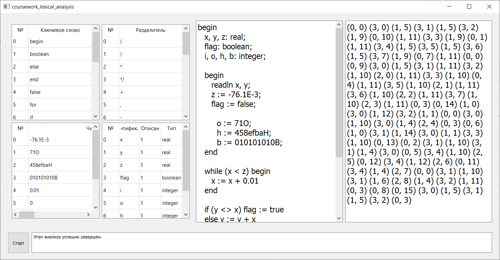

# Automata and formal languages theory

Решение включает:
- Компилятор модельного языка (лексический, синтаксический и семантический этапы анализа; скриншот ниже);
- Определитель типа грамматики по исходному файлу с её описанием;
- Реализация автомата с магазинной памятью.

  

## Сборка и запуск

Проекты собираются и запускаются в Visual Studio при помощи расширения Qt Visual Studio Tools.
